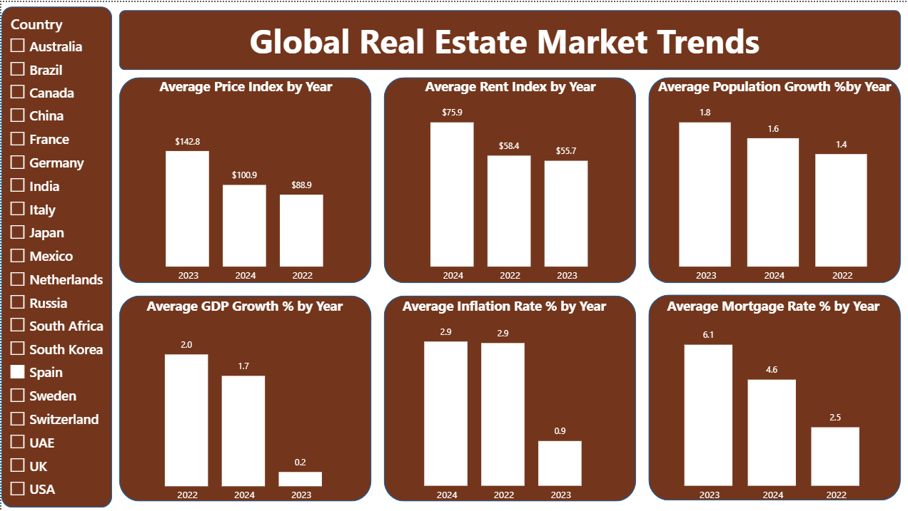

# 🏠 Global Real Estate Market Trends Dashboard

## 📌 Project Overview

This project was developed using Power BI to analyze global real estate market trends and provide insights into housing market dynamics across multiple countries. The dashboard evaluates property prices, rental indices, and economic indicators to support investment and development decisions.

---

## 🎯 Business Problem

Real estate markets are influenced by various economic and demographic factors. Investors, developers, and policymakers require a clear understanding of market trends to make informed decisions regarding property investments and future developments.

This project aimed to identify patterns in property prices, rental markets, and economic indicators across different countries.

---

## 🎯 Project Objectives

* Analyze property prices and rental market trends.
* Compare real estate performance across countries.
* Track key economic indicators affecting housing markets.
* Evaluate the impact of inflation, GDP growth, mortgage rates, and population growth.
* Support investment and development decision-making through interactive visualizations.

---

## 📊 Dashboard Preview

### Real Estate Market Trends Dashboard

---

## 📊 Analysis Performed

### Housing Market Analysis

* Average Price Index by Year
* Average Rent Index by Year

### Economic Indicator Analysis

* Average GDP Growth % by Year
* Average Inflation Rate % by Year
* Average Mortgage Rate % by Year
* Average Population Growth % by Year

### Interactive Features

* Country-Level Filtering
* Multi-Year Trend Analysis
* Cross-Country Comparison

---

## 🔍 Key Insights

* Property prices varied significantly across years, reflecting changing market conditions.
* Rental market trends showed differences in housing demand and affordability.
* Inflation and mortgage rates played a major role in influencing housing market activity.
* GDP growth and population growth served as important indicators of long-term real estate demand.
* Country-level analysis helped identify markets with stronger growth potential and investment opportunities.

---

## 📑 Executive Summary

This project analyzed global real estate market trends using Power BI by examining property prices, rental indices, and key economic indicators across multiple countries. The analysis explored the relationship between housing market performance and factors such as GDP growth, inflation rates, mortgage rates, and population growth.

The dashboard enabled country-level comparisons and trend analysis, providing valuable insights into market conditions, investment potential, and economic influences on the real estate sector. The findings support data-driven decision-making for investors, developers, and business stakeholders seeking to understand global real estate dynamics.

---

## 🛠️ Tools & Technologies

* Power BI
* Power Query
* DAX
* Data Modeling
* Data Visualization
* Business Intelligence

---

## 📚 Skills Demonstrated

* Data Analysis
* Trend Analysis
* Real Estate Analytics
* Economic Indicator Analysis
* Dashboard Development
* Data Visualization
* Business Intelligence
* Insight Generation

---

## 🚀 Business Impact

The dashboard provides a centralized view of real estate market performance and economic trends, helping users identify market opportunities, evaluate risk factors, and make informed investment decisions based on data-driven insights.

---

## 👨‍💻 Author

**Shaik Anas**

MBA (Business Analytics)
JNTU Kakinada School of Management Studies

### Internship

CopeAlpha – Power Bi Internship
